# Database Testing Using XAMPP

## Create University Table:

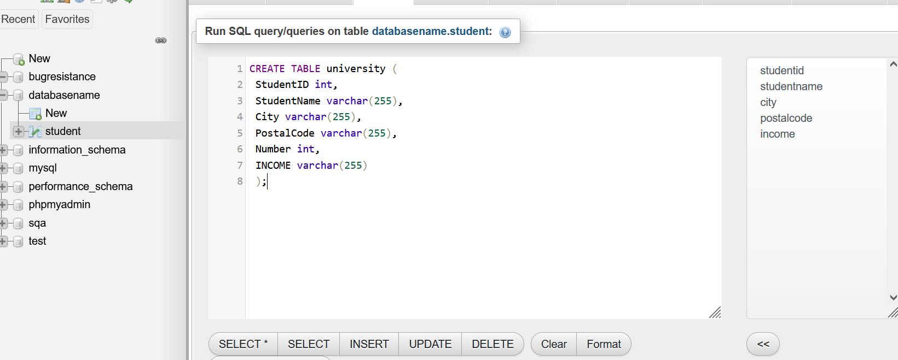

## Insert Values in University:

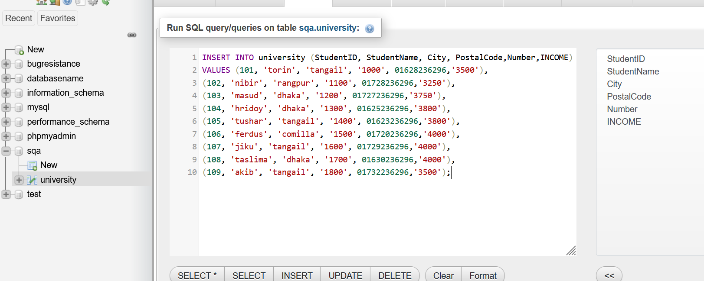

## University Table:

## Find Data by City:

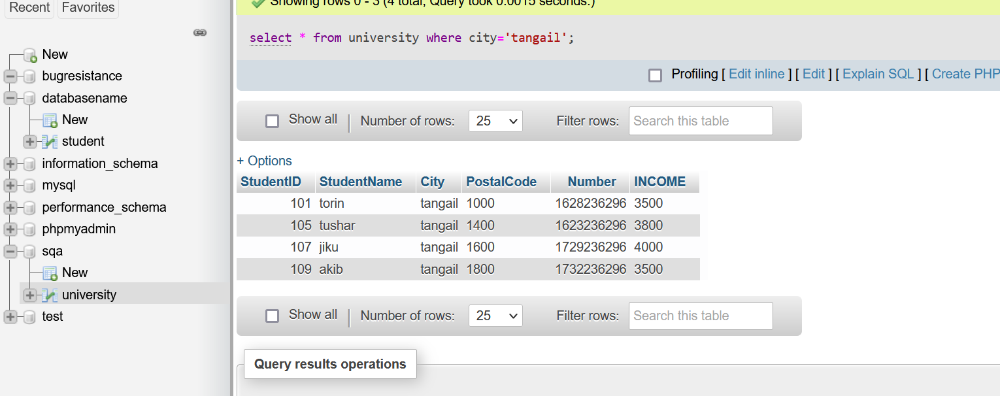

## Between Operator select values:

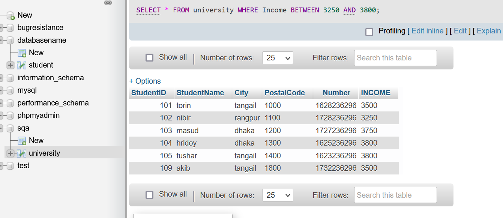

## MAX Function:

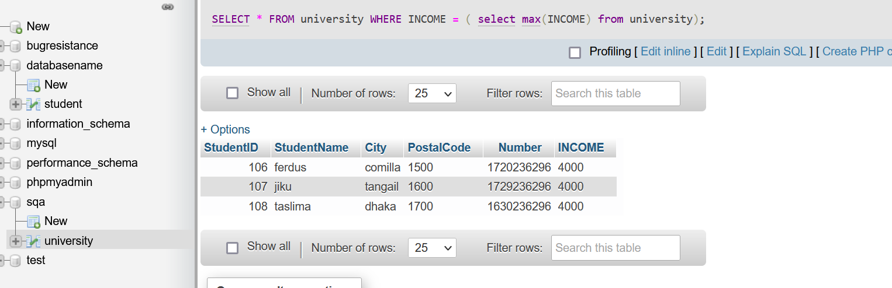

## MIN Function:

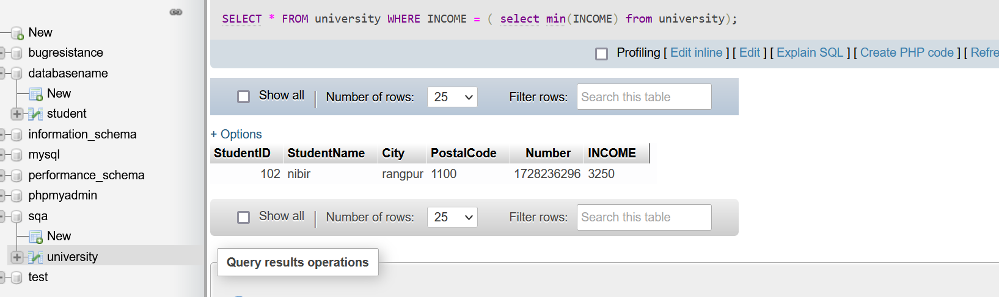

## Create Student Table:

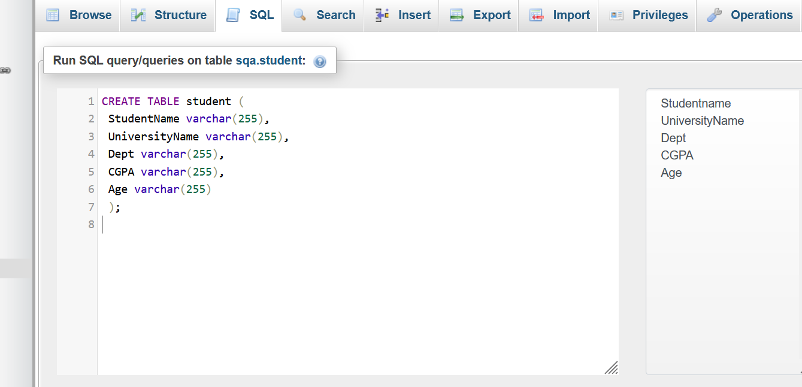

## Insert values in Student:

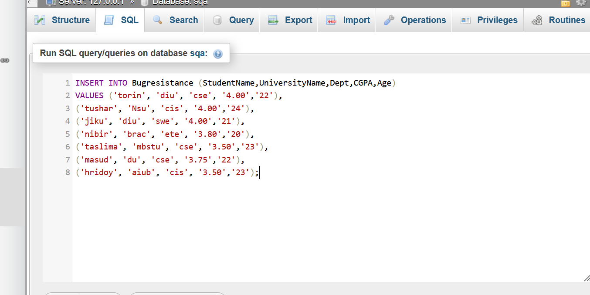

## Student Table:

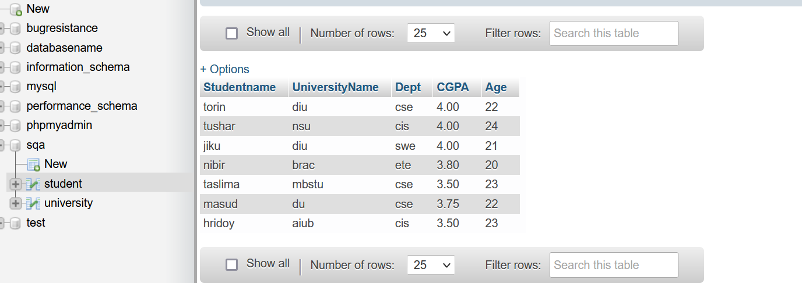

## Insert Values in Inner Join:

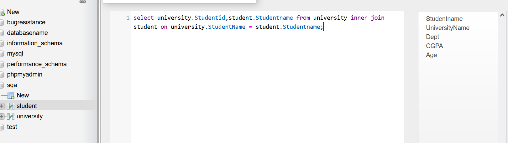

## Inner Join Table:

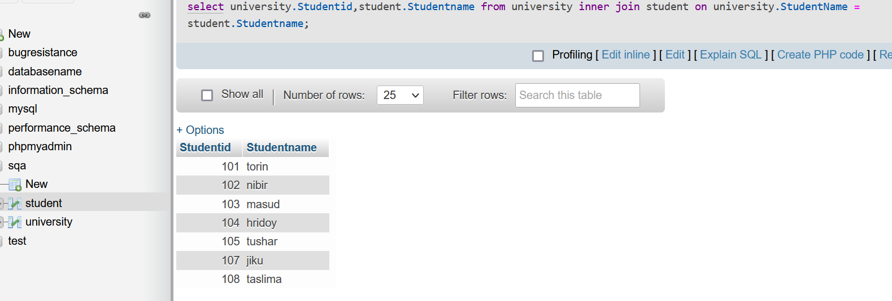

## Insert Values in Left Join:

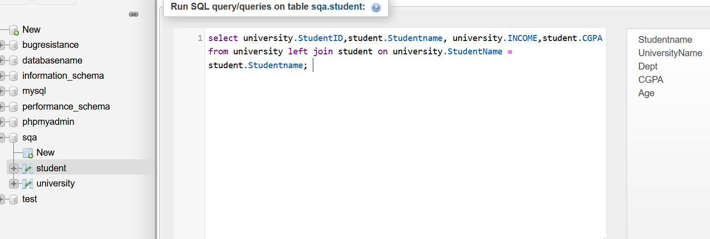

## Left Join Table:

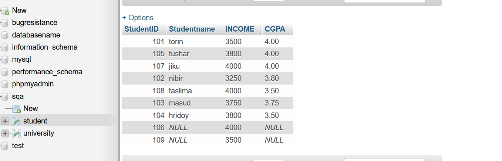

## Insert Values in Right Join:

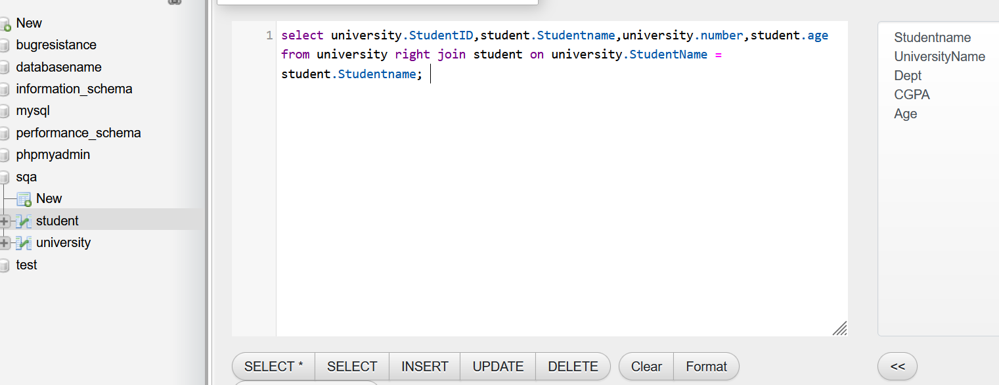

## Right Join Table:

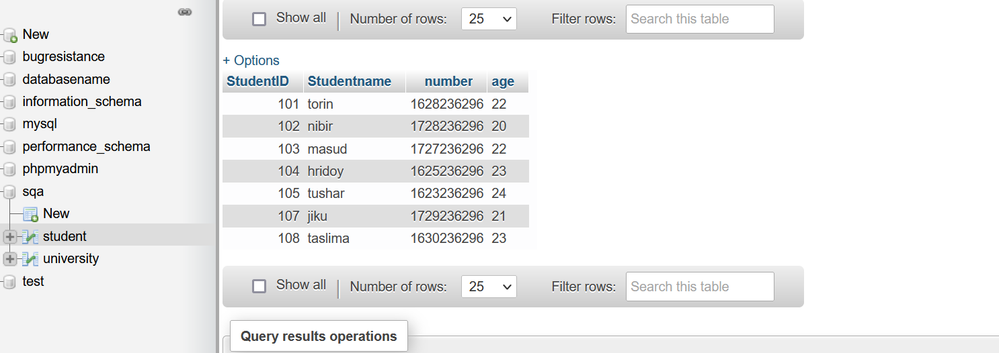

## Insert Values in Full Join:

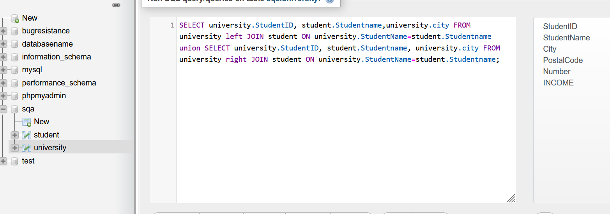

## Full Join Table:

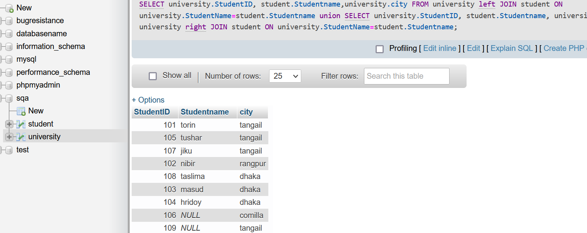
