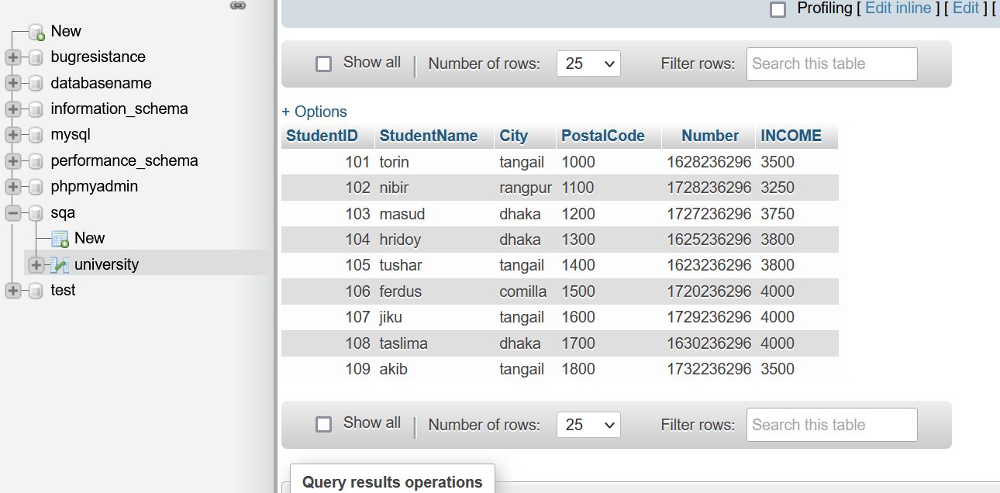

# Database Testing Using XAMPP

## Create University Table:

## Insert Values in University:

## University Table:

## Find Data by City:

## Between Operator select values:

## MAX Function:

## MIN Function:

## Create Student Table:

## Insert values in Student:

## Student Table:

## Insert Values in Inner Join:

## Inner Join Table:

## Insert Values in Left Join:

## Left Join Table:

## Insert Values in Right Join:

## Right Join Table:

## Insert Values in Full Join:

## Full Join Table:

